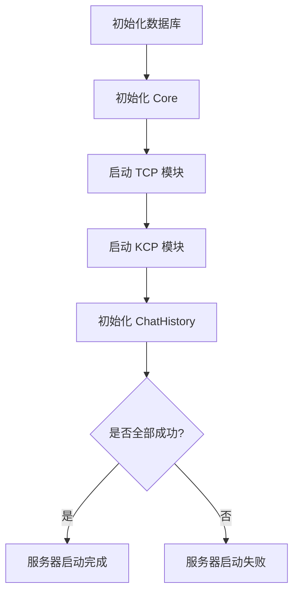
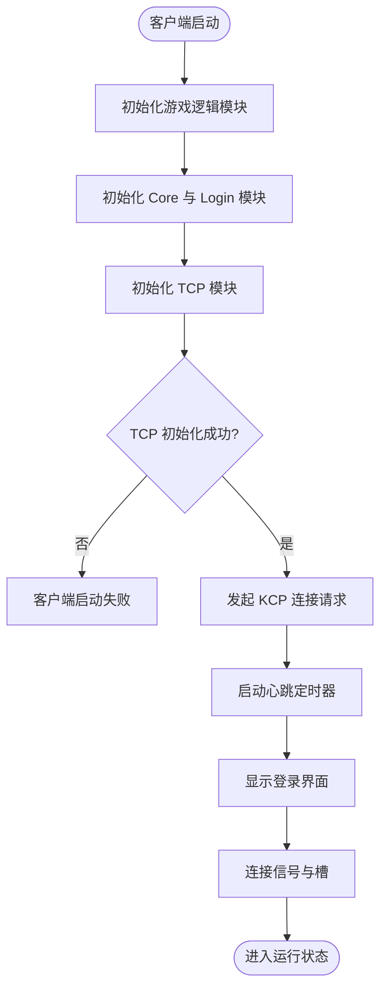
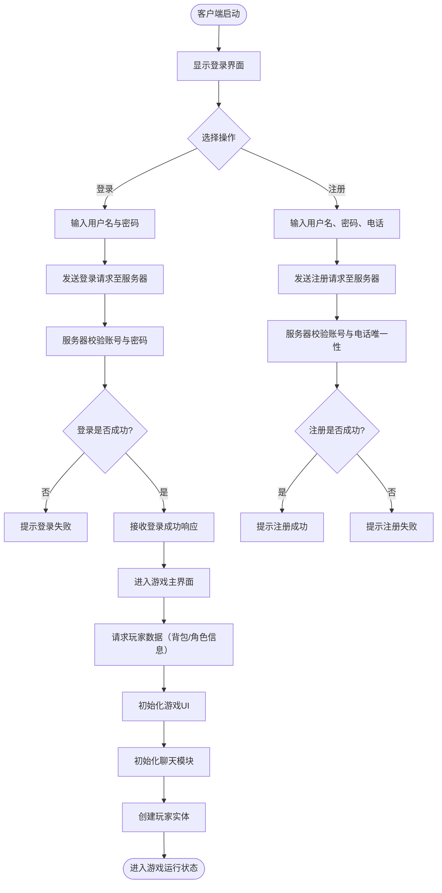
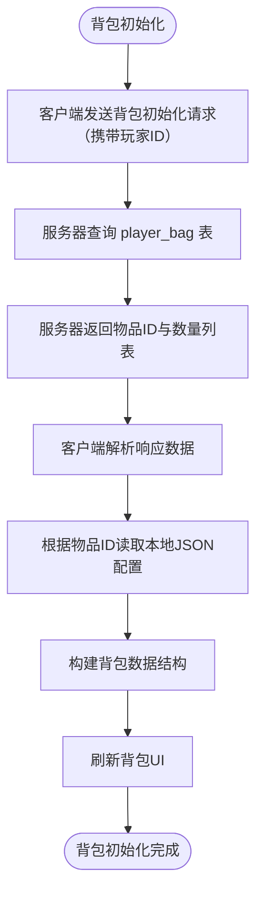

# 整体架构设计

## 系统架构图

```C++
Server
  网络模块
  	TCP模块：TCPNet
  	KCP模块：KCPNet
  数据库模块：
  	数据库核心：CMySql
  	连接池：mysqlconnpool
  业务逻辑模块：core
  协议模块：
  	协议包：packdef
  	协议发送模版：packetbuilder
  常用全局变量模块：tou

client
  网络模块
  	TCP模块：TCPNet
  	KCP模块：KCPNet
  网络-逻辑交换模块：core
  游戏逻辑模块：gameclient
  物品模块：
		物品：item
  	物品工厂类：itemfactory
  登录模块：login
  聊天模块：chat
  npc模块：ncp
  玩家模块：player
  背包模块：playerbag
  地图模块：tilemap
  UI模块：widget
  物品JSON数据：item.JSON
  地图数据：data
```

## 数据流说明

### 服务器启动流程：



### 客户端启动流程：



### 客户端-服务器登录注册流程：



### 背包初始化流程：


